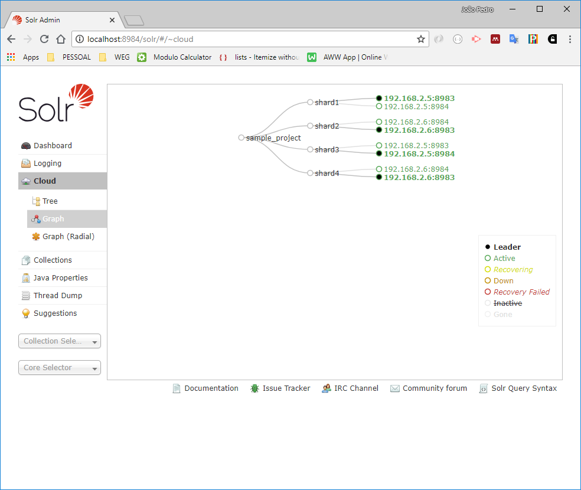
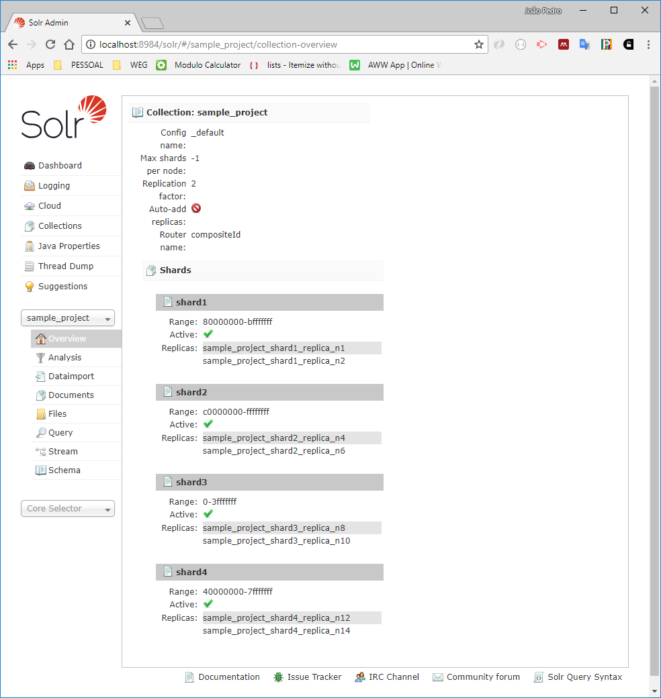

# SOLR CLOUD + ZOOKEEPER + WINDOWS

## Introduction

This small tutorial aims to introduce how to configure SOLR + ZOOKEEPER in an Windows environment. This configuration is a introductory example, for more informations about please check the [SOLR](http://lucene.apache.org/solr/) official site.

Besides the configuration examples, will be presented some tests performed about the query execution and index growth related with data indexation.

## Directories structure

All configurations were made under the directory C:\solr. To begin, first download the latest stable version from SOLR and ZOOKEEPER. In this tutorial, the following versions were applied:

* [SOLR 7.3](http://www.apache.org/dyn/closer.lua/lucene/solr/7.3.0)
* [ZOOKEEPER 3.4.13](https://www.apache.org/dyn/closer.cgi/zookeeper/)

Then, unzip the downloaded files under the "C:\solr" folder. After that create two more folders "solr_cloud" and "zookeeper_data".

The layout directory structure should to be similar as:

* C:\solr\solr-7.3.0
* C:\solr\zookeeper-3.4.13
* C:\solr\solr_cloud
* C:\solr\zookeeper_data

Before start to configure zookeeper and SOLR, be sure that JAVA_HOME environment variable is configured.

## Zookeeper

ZooKeeper is a distributed co-ordination service to manage large set of hosts. Basically, it uses a concept of virtual file system that is shared among the participants nodes of an ensemble. In this VFS new nodes can publish, query and listen for data. A good start point to study zookeeper concepts is available at [Tutorialspoint](https://www.tutorialspoint.com/zookeeper/).

To configure SOLR the zookeeper is necessary to persist file configuration and manage the cluster policies. The solr and zookeeper documentations indicates to have at least three servers in the cluster. However, in this small introdutory tutorial, only one will be applied. 

To configure the zookeeper, first rename the file from zoo_sample.cfg to zoo.cfg. This file is present in the directory C:\solr\zookeeper-3.4.13\conf. After that, open this file and edit the property dataDir to the directory C:/solr/zookeeper_data. Pay attention to the folder separator, even in windows, the folder separator should keep the linux character. The file should to be similar as the following:

```
tickTime=2000
initLimit=10
syncLimit=5
dataDir=C:/solr/zookeeper_data
clientPort=2181
```

The zookeeper configuration is ready. Thus, open a new terminal window and enter in the zookeeper bin directory.

> cd C:\solr\zookeeper-3.4.13\bin

And start the zookeeper server. The zookeeper will be started at 2181 port.

> zkServer.cmd

Now, to check that zookeeper is up and working properly, open a new terminal session and from the zookeeper bin directory again, start the zookeeper client with the following command:

> zkCli.cmd

If everything is working, the connection with zookeeper will be opened sucessfully and you will view something like this:

> ... <br /> WATCHER:: <br /><br /> WatchedEvent state:SyncConnected type:None path:null <br /><br /> [zk: localhost:2181(CONNECTED) 0]

Now, you have access to the zookeeper virtual directory. For example, type the following command to list the root zookeeper directory.

> [zk: localhost:2181(CONNECTED) 0] ls /<br />[zookeeper]

If you check the zookeeper data directory configured in zoo.cfg (C:\solr\zookeeper_data), all data that zookeeper will store is persited there. It means that, all SOLR files configuration will be stored in this directory. Even zookeeper persisting this files in the disk, is a good point to have a source code versioning system to keep track of these files.

## SOLR

Solr is the popular, blazing-fast, open source enterprise search platform built on Apache Lucene™. And in this tutorial, a simple Solr cloud configuration will be presented. 

### SOLR and ZOOKEEPER

The first thing to configure SOLR with a isolated zookeeper server instance, is upload the solr.xml to the zookeeper directory. It is made with the following command executed under the solr dir:

> C:\solr\solr-7.3.0> bin\solr zk cp file:C:\solr\solr-7.3.0\server\solr\solr.xml zk:/solr.xml -z localhost:2181
<br />Copying from 'file:C:\solr\solr-7.3.0\server\solr\solr.xml' to 'zk:/solr.xml'. ZooKeeper at localhost:2181

After that, the configsets need to be uploaded to the zookeeper. The configsets are the schemas definition to create collections. There are some different ways to upload these files to zookeeper. One is starting a solr server that upload this files automatically and one other is uploading manually. In this case, we will upload this files manually with the following command:

> C:\solr\solr-7.3.0> bin\solr zk upconfig -n _default -d C:\solr\solr-7.3.0\server\solr\configsets\\_default -z localhost:2181 <br/>
Uploading C:\solr\solr-7.3.0\server\solr\configsets\\_default\conf for config _default to ZooKeeper at localhost:2181

We can check if everything is right executing the following commands in the zookeeper client:

> [zk: localhost:2181(CONNECTED) 1] ls /<br />[solr.xml, configs, zookeeper]<br />[zk: localhost:2181(CONNECTED) 5] ls /configs<br />[_default]<br />[zk: localhost:2181(CONNECTED) 6] ls /configs/_default<br />[managed-schema, protwords.txt, solrconfig.xml, synonyms.txt, stopwords.txt, lang, params.json]

### SOLR NODES

Now we will configure the server nodes. In this simple tutorial, we will create a different directory to persist the index data, the directory "C:\solr\solr_cloud" that was created previously. Besides that, the objetive is to test Solr with two different computers and each one executing two isolated server instances. The defined architecture is presented following:

* PC 1 - Node 1 - port 8983
* PC 1 - Node 2 - port 8984
* PC 2 - Node 1 - port 8983
* PC 2 - Node 2 - port 8984

To start more than one server in the PC 1, a custom log configuration is necessary because servers cannot share the default log file in the folder "C:\solr\solr-7.3.0\server\logs". To support this architecture execute the following steps:

* Create the folder "C:\solr\solr_cloud\resources"
* Copy "C:\solr\solr-7.3.0\example\resources\log4j.properties" to "C:\solr\solr_cloud\resources"
* Create the solr folders: "C:\solr\solr_cloud\cloud\node1" and "C:\solr\solr_cloud\cloud\node2"
* Create the index folders: "C:\solr\solr_cloud\cloud\node1\solr" and "C:\solr\solr_cloud\cloud\node2\solr"
* Create the log folders: "C:\solr\solr_cloud\cloud\node1\logs" and "C:\solr\solr_cloud\cloud\node2\logs"

To start the nodes, before is necessary to change the environment variables to point properly for the log folders. First, execute the following command to define the log configuration file:

> set LOG4J_CONFIG=file:C:\solr\solr_cloud\resources\log4j.properties

Then change the server log directory:

> set SOLR_LOGS_DIR=C:\solr\solr_cloud\cloud\node1\logs

Then start the first SOLR node. In this case, the -z parameter indicates the zookeeper, -s the solr directory, -c the cloud mode and -p the server port.

> bin\solr start -c -p 8983 -s "C:/solr/solr_cloud/cloud/node1/solr" -z localhost:2181

Then start the second node. First change the log directory to node 2:

> set SOLR_LOGS_DIR=C:\solr\solr_cloud\cloud\node2\logs

Then start the node 2 server in a new port:

> bin\solr start -c -p 8984 -s "C:/solr/solr_cloud/cloud/node2/solr" -z localhost:2181

To start the PC 2, execute the same steps to configure the Solr server. But now change the -z parameter to appoint to the IP of the zookeeper computer.

> set LOG4J_CONFIG=file:C:\solr\solr_cloud\resources\log4j.properties<br />set SOLR_LOGS_DIR=C:\solr\solr_cloud\cloud\node1\logs<br />bin\solr start -c -p 8983 -s "C:/solr/solr_cloud/cloud/node1/solr" -z 192.168.2.6:2181<br />set SOLR_LOGS_DIR=C:\solr\solr_cloud\cloud\node2\logs<br />bin\solr start -c -p 8983 -s "C:/solr/solr_cloud/cloud/node2/solr" -z 192.168.2.6:2181

If everything is right the servers should be acessible at the URLS:

* PC1_IP:8983/solr/#/
* PC1_IP:8984/solr/#/
* PC2_IP:8983/solr/#/
* PC2_IP:8984/solr/#/

Or checking in te zookeeper client the active nodes:

> [zk: localhost:2181(CONNECTED) 8] ls /live_nodes<br />[192.168.2.5:8983_solr, 192.168.2.6:8983_solr, 192.168.2.6:8984_solr, 192.168.2.5:8984_solr]

### SOLR creating core

To create a solr cloud core, execute the following command:

> bin\solr create -c sample_project -s 4 -rf 2 -d _default -n _default

This command will create a new core named sample_project (param -c), with the config _default (param -d) using the existing config _default from zookeeper(param -n). The parameter -s define the number of shards, that is, the number of chunks that solr will use to segment the index. And the parameter -rf define the replication factor, that is the number of copies available for each shard. The replication factor is used as failover mechanism in case of failures. To validate that everything is right, we can check in zookeeper the status with the following command:

> [zk: localhost:2181(CONNECTED) 12] ls /collections<br />[sample_project]

A more user-friendly way to check the architecture is inspecting the cloud informations in the solr WEB page, that will be similar as the following figure:



And about the core informations:

